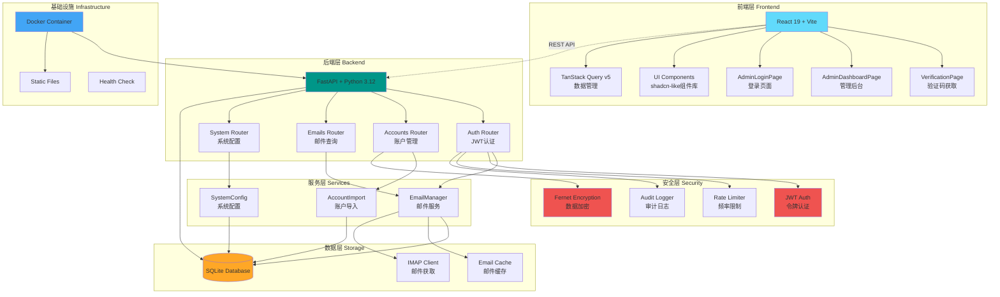

# Outlooker

<div align="center">

**现代化的 Outlook 邮件管理与验证码提取平台**

[](CHANGELOG.md)
[](https://www.python.org/downloads/)
[](https://fastapi.tiangolo.com/)
[](https://reactjs.org/)
[](https://www.typescriptlang.org/)
[](CHANGELOG.md)
[](CHANGELOG.md)
[](LICENSE)

</div>

---

## 📖 项目简介

**Outlooker** 是一个功能强大的 Outlook 邮件管理系统，专为高效管理多个邮箱账户、快速提取验证码而设计。系统采用现代化技术栈，提供完善的安全机制和友好的用户界面。

### ✨ 核心特性

- 🔐 **安全可靠**：JWT 认证、数据加密存储、登录频率限制、审计日志
- 📧 **邮件管理**：支持多账户、分页查询、文件夹切换、模糊搜索、标记已读、删除
- 🎯 **验证码提取**：自动识别并提取邮件中的 4-6 位验证码
- 👥 **账户管理**：批量导入/导出、标签分类、账户搜索、**批量删除、批量标签**
- 📊 **系统监控**：缓存命中率、IMAP 连接复用、运行指标统计、健康检查端点、**API 性能指标**
- 🎨 **现代 UI**：基于 React 19 + **TypeScript** + Tailwind CSS 4 + TanStack Query v5，shadcn-like 组件库，响应式布局
- 🐳 **容器化部署**：提供 Docker 和 Docker Compose 配置
- 🔧 **模块化架构**：数据库操作采用 Mixin 模式，**统一异常处理装饰器**，配置可外部化

### 🏗️ 技术架构



## 📁 项目结构

```
outlooker/
├── backend/                    # 后端服务
│   ├── app/                   # FastAPI 应用核心
│   │   ├── routers/           # API 路由（账户、邮件、系统、认证）
│   │   ├── services/          # 业务逻辑层
│   │   ├── db/                # 数据库操作模块（Mixin 架构）
│   │   ├── auth/              # 认证与安全模块
│   │   │   ├── jwt.py         # JWT 认证
│   │   │   ├── security.py    # 数据加密
│   │   │   ├── oauth.py       # OAuth2 集成
│   │   │   └── refresh_token.py # 刷新令牌管理
│   │   ├── core/              # 核心功能模块
│   │   │   ├── exceptions.py  # 统一异常处理
│   │   │   ├── messages.py    # 消息常量
│   │   │   ├── rate_limiter.py # 频率限制
│   │   │   ├── decorators.py  # 异常处理装饰器
│   │   │   ├── metrics.py     # API 性能指标
│   │   │   ├── middleware.py  # 监控中间件
│   │   │   └── startup.py     # 启动验证
│   │   ├── utils/             # 工具函数
│   │   ├── migrations/        # 数据库迁移脚本
│   │   ├── models.py          # Pydantic 数据模型
│   │   ├── settings.py        # 配置管理
│   │   └── mail_api.py        # FastAPI 应用入口
│   ├── configs/               # 配置文件
│   └── requirements.txt       # Python 依赖
├── frontend/                  # 前端应用 (TypeScript)
│   ├── src/
│   │   ├── components/        # React 组件
│   │   │   ├── ui/            # 基础 UI 组件 (Button, Input, Dialog...)
│   │   ├── pages/             # 页面组件
│   │   │   └── dashboard/     # 管理后台子模块
│   │   ├── hooks/             # 自定义 Hooks
│   │   ├── lib/               # 工具库
│   │   ├── types/             # TypeScript 类型定义
│   │   ├── i18n/              # 国际化配置
│   │   └── main.tsx           # 应用入口
│   ├── e2e/                   # E2E 测试 (Playwright)
│   └── package.json           # Node.js 依赖
├── docker/                    # Docker 部署配置
│   ├── Dockerfile             # 容器镜像
│   ├── docker-compose.yml
│   ├── deploy.sh              # 部署脚本
│   └── entrypoint.sh          # 容器入口脚本
├── docs/                      # 完整文档
│   ├── API_DOCUMENTATION.md   # API 参考
│   ├── BACKEND_README.md      # 后端详解
│   ├── LOGIN_SECURITY.md      # 安全机制
│   └── ...
├── scripts/                   # 运维脚本
│   ├── benchmarks/            # 性能基准测试
│   │   ├── benchmark_email_cache.py
│   │   └── benchmark_imap.py
│   ├── maintenance/           # 维护脚本
│   │   ├── encrypt_existing_accounts.py  # 数据加密迁移
│   │   ├── cleanup_email_cache.py        # 缓存清理
│   │   └── view_login_audit.py           # 查看登录审计
│   ├── security/              # 安全脚本
│   │   └── security_scan.sh              # 安全扫描
│   └── run_smoke_tests.py     # 冒烟测试
├── tests/                     # 集成测试
├── data/                      # 运行时数据（Git 忽略）
│   ├── outlook_manager.db     # SQLite 数据库
│   ├── logs/                  # 日志文件
│   └── static/                # 前端构建产物
└── .env                       # 环境配置（需手动创建）
```

## 🚀 快速开始

### 环境要求

- Python 3.12+
- Node.js 18+
- SQLite 3

### 1. 克隆项目

```bash
git clone <repository-url>
cd outlooker
```

### 2. 配置环境变量

参考 `docs/ENV_SAMPLE.md` 填写 `.env`（或 `backend/.env`），生成安全随机值：
```bash
python - <<'PY'
import secrets
print("JWT_SECRET_KEY=" + secrets.token_urlsafe(32))
print("DATA_ENCRYPTION_KEY=" + secrets.token_urlsafe(32))
print("ADMIN_PASSWORD=" + secrets.token_urlsafe(16))
PY
```

### 3. 启动后端

```bash
cd backend
pip install -r requirements.txt
python -m app.mail_api web
# 需要热重载：UVICORN_RELOAD=true python -m app.mail_api web
# 后端将在 http://localhost:5001 启动
```

### 4. 启动前端（新终端）

```bash
cd frontend
npm install
npm run dev
# 前端将在 http://localhost:5173 启动
```

### 5. 访问应用

**开发环境**:
- **前端应用**: http://localhost:5173
- **后端 API**: http://localhost:5001
- **API 文档**: http://localhost:5001/docs

**生产环境** (构建后):
- **所有服务**: http://localhost:5001

## 🐳 Docker 部署

```bash
# 方式一：使用部署脚本
cd docker
chmod +x deploy.sh
./deploy.sh build
./deploy.sh start

# 方式二：直接使用 docker-compose
cd docker
docker-compose up -d
```

容器将在 http://localhost:5001 提供服务。

## 📚 完整文档

| 文档 | 说明 |
|------|------|
| [更新日志](CHANGELOG.md) | 版本历史和变更记录 |
| [后端架构](docs/architecture.md) | 后端架构、数据库设计、核心功能 |
| [快速开始](docs/getting-started.md) | 开发环境配置、常见任务 |
| [API 参考](docs/api-reference.md) | 完整的 REST API 接口说明 |
| [安全机制](docs/security.md) | 频率限制、防爆破、审计日志 |
| [安全测试](docs/security-testing.md) | 安全改进验证步骤 |
| [依赖维护](docs/maintenance.md) | 依赖升级和安全审计 |

## 🔧 开发命令

| 任务 | 命令 |
|------|------|
| 后端开发 | `cd backend && python -m app.mail_api web` |
| 前端开发 | `cd frontend && npm run dev` |
| 前端构建 | `cd frontend && npm run build` |
| 后端测试 | `cd backend && pytest` |
| 前端测试 | `cd frontend && npm run test` |
| 类型检查 | `cd backend && mypy app` / `cd frontend && npm run typecheck` |
| 代码检查 | `cd backend && ruff check .` / `cd frontend && npm run lint` |
| 安全扫描 | `./scripts/security/security_scan.sh` |
| 健康检查 | `curl http://localhost:5001/api/health` |
| API 指标 | `curl http://localhost:5001/api/system/metrics` |

## 🔒 安全特性

Outlooker 实现了多层安全防护：

### 认证与授权
- ✅ JWT Token 认证（默认 24 小时有效期）
- ✅ 管理员密码 bcrypt 哈希存储
- ✅ Legacy Token 默认禁用（可选开启）

### 数据保护
- ✅ 敏感数据（密码、Refresh Token）使用 Fernet 对称加密
- ✅ 环境变量管理密钥，支持密钥轮换
- ✅ 数据库自动迁移和版本管理

### 防护机制
- ✅ 登录频率限制（5 分钟内最多 5 次失败）
- ✅ 失败锁定（锁定 15 分钟）
- ✅ 审计日志（所有登录尝试记录）
- ✅ CORS 白名单控制

### 日志审计
- ✅ 登录审计日志：`data/logs/login_audit.log`
- ✅ 敏感信息脱敏
- ✅ 查看工具：`python scripts/maintenance/view_login_audit.py`

## 🛠️ 运维脚本

| 脚本 | 用途 |
|------|------|
| `scripts/maintenance/encrypt_existing_accounts.py` | 迁移旧账户数据到加密存储 |
| `scripts/maintenance/cleanup_email_cache.py` | 清理过期邮件缓存 |
| `scripts/maintenance/view_login_audit.py` | 查看登录审计日志统计 |
| `scripts/test_security_improvements.py` | 安全改进自动化验证 |
| `scripts/test_rate_limiting.py` | 频率限制功能测试 |
| `scripts/run_smoke_tests.py` | 部署后冒烟测试 |
| `scripts/security/security_scan.sh` | 依赖安全扫描 |
| `scripts/benchmarks/benchmark_email_cache.py` | 邮件缓存性能测试 |
| `scripts/benchmarks/benchmark_imap.py` | IMAP 连接性能测试 |

## 📊 主要功能

### 1. 简单收件界面（验证码工具）

**访问路径**: `/` (首页)

提供简洁的验证码获取界面，专注核心功能：

- ✅ 输入邮箱地址（必须是已配置的数据库账户）
- ✅ 自动获取最新 1 封邮件
- ✅ 智能提取 4-6 位验证码（大字号显示）
- ✅ 一键复制验证码到剪贴板
- ✅ 刷新按钮重新获取最新邮件
- ✅ 显示邮件主题、发件人、接收时间
- ✅ 支持 HTML 和纯文本邮件渲染
- ✅ 明确的加载、错误、空状态提示

**设计理念**: 扁平化设计，统一视觉风格，移动端友好

### 2. 账户管理

**访问路径**: `/admin` (管理后台)

完善的账户管理功能：

- ✅ 批量导入/导出（支持文本格式）
- ✅ 账户标签分类和过滤
- ✅ **批量操作**：
  - 批量选择账户（全选/单选）
  - 批量删除账户
  - 批量标签操作（添加/移除/替换）
- ✅ **增强的分页功能**：
  - 每页显示数量选择（10/20/50/100 条）
  - 智能页码导航（当前页前后显示，中间省略号）
  - 快速跳转到指定页（输入框 + 验证）
  - 总记录数统计显示
  - 移动端响应式布局
- ✅ 模糊搜索（按邮箱地址）
- ✅ 敏感信息加密存储
- ✅ 脱敏预览（密码、Token）
- ✅ 邮件查看（完整正文 + 验证码提取）

### 3. 邮件查看与管理

**功能**: 点击账户的"查看邮件"按钮

- ✅ 分页、搜索、文件夹切换
- ✅ 一次性加载完整邮件正文
- ✅ 验证码高亮显示（渐变背景 + 大字号）
- ✅ 邮件元信息（发件人、时间、主题）
- ✅ 支持 HTML 和纯文本邮件
- ✅ **邮件管理操作**：
  - 删除缓存邮件
  - 标记邮件已读
- ✅ 明确的加载状态（旋转动画 + 提示文字）
- ✅ 完善的空状态和错误处理

### 4. 系统配置

- ✅ 邮件获取数量配置
- ✅ 缓存管理（一键刷新）
- ✅ 运行指标监控
- ✅ 配置文件和数据库双重持久化

### 5. 管理后台

- ✅ JWT 安全登录（频率限制 + 审计日志）
- ✅ 账户 CRUD 操作
- ✅ 标签管理界面
- ✅ 系统配置面板
- ✅ 缓存和指标监控

### 6. 代码复用与异步优化

- ✅ 通用分页与搜索工具：在 `backend/app/utils/pagination.py` 中集中处理分页和邮件搜索逻辑，避免在多个路由中重复实现
- ✅ 邮箱规范化复用：通过 `normalize_email` 统一账号相关邮箱字符串处理，`_normalize_email` 仅作为向后兼容包装
- ✅ 数据库异步封装优化：`DatabaseManager` 使用专用 `ThreadPoolExecutor` 统一承载所有同步 SQLite 操作，替代零散的 `asyncio.to_thread` 调用，提升可维护性

## 🧪 测试

项目拥有完善的测试覆盖,确保代码质量和稳定性:

**测试统计** (v2.5.0):
- 后端测试: 215 个测试 (100% 通过率)
- 前端测试: 23 个测试 (100% 通过率)
- 总测试数: 238
- 覆盖率: 70%

**v2.4.0 测试更新**:
- ✅ 新增 IMAP 客户端单元测试
- ✅ CI 增强：覆盖率阈值、安全扫描
- ✅ TypeScript 类型检查集成到 CI

```bash
# 后端测试
cd backend
pytest                    # 运行所有测试
pytest -v                 # 详细输出
pytest --cov=app          # 带覆盖率报告
pytest tests/test_jwt_auth.py      # JWT认证测试
pytest tests/test_database.py      # 数据库测试
pytest tests/test_imap_client.py   # IMAP客户端测试

# 前端测试
cd frontend
npm run test              # 运行测试
npm run test -- --coverage  # 带覆盖率
npm run typecheck         # TypeScript类型检查
```

**测试覆盖的关键领域**:
- ✅ JWT认证和授权
- ✅ 密码哈希和验证
- ✅ 数据库CRUD操作
- ✅ 数据库迁移系统
- ✅ 账户导入和合并
- ✅ 系统配置管理
- ✅ 数据加密解密
- ✅ IMAP 客户端连接和令牌管理
- ✅ React组件渲染

## 🐛 故障排查

### 后端无法启动

```bash
# 检查环境变量
cat .env | grep -E "JWT_SECRET_KEY|DATA_ENCRYPTION_KEY|CLIENT_ID"

# 查看日志
tail -f data/logs/login_audit.log
```

### 数据加密问题

```bash
# 验证密钥配置
python -c "import os; print('KEY:', 'SET' if os.getenv('DATA_ENCRYPTION_KEY') else 'NOT SET')"

# 重新运行加密迁移
python scripts/maintenance/encrypt_existing_accounts.py
```

### 前端无法连接后端

```bash
# 检查后端是否运行
curl http://localhost:5001/docs

# 检查 CORS 配置
grep ALLOWED_ORIGINS .env
```

## 📝 环境变量说明

```bash
# 必需配置
JWT_SECRET_KEY=<随机生成的密钥>        # JWT 签名密钥
DATA_ENCRYPTION_KEY=<随机生成的密钥>   # 数据加密密钥
CLIENT_ID=<Microsoft OAuth2 客户端ID>  # Azure AD 应用ID
PUBLIC_API_TOKEN=<随机生成的密钥>      # 公共接口调用口令（生产必填）

# 管理员配置
ADMIN_USERNAME=admin                    # 管理员用户名
ADMIN_PASSWORD=<强密码>                # 管理员密码

# 可选配置
APP_ENV=development                     # 环境标识（development/production）
ALLOWED_ORIGINS=http://localhost:5173   # CORS 白名单（逗号分隔）
ENABLE_LEGACY_ADMIN_TOKEN=false         # 是否启用旧版 Token
LEGACY_ADMIN_TOKEN=<随机生成的密钥>      # 旧版 Token 值（仅在 ENABLE_LEGACY_ADMIN_TOKEN=true 时需要）
DEFAULT_EMAIL_LIMIT=1                   # 默认邮件获取数量
ADMIN_REFRESH_COOKIE=true               # 启用 httpOnly 刷新 Cookie（默认开启）
ADMIN_REFRESH_COOKIE_SECURE=false       # 开发环境设为 false，生产请改为 true
```

## 🤝 贡献指南

欢迎贡献代码！请遵循以下流程：

1. Fork 项目
2. 创建特性分支 (`git checkout -b feature/AmazingFeature`)
3. 提交改动 (`git commit -m 'Add some AmazingFeature'`)
4. 推送分支 (`git push origin feature/AmazingFeature`)
5. 提交 Pull Request

### 代码规范

- 后端：遵循 PEP 8，使用 `ruff` 进行代码检查
- 前端：遵循 ESLint 配置
- 提交信息：清晰描述改动内容

## 📄 许可证

本项目采用 MIT 许可证 - 详见 [LICENSE](LICENSE) 文件

## 📮 联系方式

- 问题反馈：[GitHub Issues](../../issues)
- 功能建议：[GitHub Discussions](../../discussions)

---

<div align="center">

**使用 ❤️ 和 ☕ 构建**

[📖 文档](docs/) · [🐛 报告问题](../../issues) · [✨ 功能请求](../../discussions)

</div>
